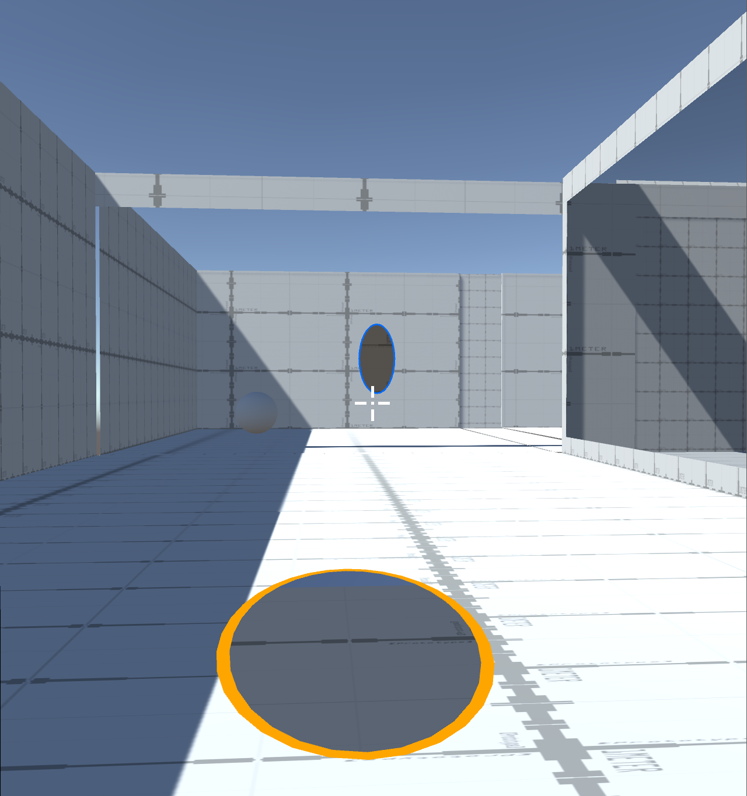

# Graphics_Lab
## Students:

 - Wajeeh Atrash - 322773946
 
 - Saji Assi - 314831207
## The project Directed by - **Dr. Roi poranne**
## Working Progress:
- **Week1**: discussing the game idea,taking the green light for writing a pitch for the game, working on the pitch ,opening a repo for the project.
- **Week2**: learning Unity implementing vasic movment for the character wolking all direction and jumping it took us a wjile to find a way to implement the jumping mechanism that allows the player to jump only when he is on the ground, beside the movement we added the mechanism to switch controll between the character and made the game first person view, we have an issue with it the player doesn't move to the direction he is facing we searched for a solution and tried 2 different ways and didn't worked for us(3 hours)

- **Week3**:

	- fixing the bug from the last week 1 hour.
	- changing the camera position with player changing 0.5 hour.
	- adding a pickup mechansim to hold cubes 1.5 hour.
	- trying to add iteractble text (didnt work) 1 hour.
	- watching unity pro builder tutrials and modeling a basic room 1.5 hour.
	-implementing a presure plate mechansim for door opening 0.5 hour.
	- design a basic demo level to domenstrate the progress and testing the added mechanism 1 hour.
	- doing some search for how to implement grabler hook gun & portal gun 1 hour.
	

- **Week4**:

	Made no progress due to other obligations.
- **Week5**:
	- implementing Grappler Gun using spring joint,we used ray cast to detect ifwe had a collision with an object we can grapple to then we added to theplayer a spring joint component to connect it with the grappling point andapplying physics on the player. (2 hours)
	- the result we got wasn't satisfying ,we tried a different approach byapplying an explosive force on the player at the direction he want to go to(didn't go will) we spend more time trying to improve our first approach andunderstanding why we got this result and we found that the main problem waschoosing the right parameters for spring joint thats fit our movementimplementation. (6 hours)
	- **finale result**:
	

- **Week6**:

	- Made no progress due to other obligations.

- **Week7**:
	- now the grapple gun can grab the pickupable items(1h).
	- Crosshair added for better aiming (0.5h).
	- added the bones for an interactable system the shows popup messages for the player (2.5h).
	
	
	

- **week8**:
	- we wasn't satisfied about the way the grapplegun grap object so we decided to change it, we tried to change the object material first , we tried to reduce the material friction first and after we grabed it we added the friction back didn't the result wasn't that good, so decided to implement an impulce force on the object and we got a good grabing movment for the object but we couldn't stop it immediatly after implying the force(we need to figure a way to do that). (1 hour)
	
	- we found a bug in the project sometimes the grapplegun doesn't hit the pickupable object intead hits the ground behind it.
	
	- fixing a small isuue in the Iteractable system displaying messages while holding the object (0.5 hour)
	- did a research about  portal guns how to implement and how to render what in the other side of the portal, this week  the main work was shooting two portals and align them on the surfaces(the portals are in the scene from the begining and when we want to shoot we just changing there locations)in addition we took care of some edge cases like overhanging and wall intersections while aligning the portals.(6.5h)
	- for next week we want to put more work on alignment,change the portal shape into an ellipse and implement the teleporting mechanism.
	
	
- **week9**:

	-replaced the portal look from a square to an ellipse,we found a bug by making this change, we found that portals where hanging on the walls and entering to walls intersections becuase of wrong layer choosing.
	-to change the portal look we downloaded a model we found on the internet and used it, the model added some compliction,we had to make the portal object more complicated and consist of several objects.(1h)
	-now we "can send objects throw the portals",when the object hits the portal collider we disable the collision physics and let him continue wallking throw the we made a clone of it that appears in the other side,when the clone is fully out from the portal we disable it and move the original object to the right place.(2.5h).
	-the player can't go throw the portal until now.
	-we made some bugs in the interactable system that we need to fix soon as possible
	
	
	

- **week10**

	- making the player getting into the portals that caused seriouse bugs like wrong camera direction after exiting from the portal ,and the player rotation. tried to fix these bugs the main idea is to calculate the direction that the camera should look at after exiting the portal and rotate it toward this direction(3h).
	- fixing the bug when the player entering the portal the camera issue solved by calculating the the direction the camera should look at and rotate the player to the state he was before entering the portal which is equals to (0,0,0) (1h).
	links that shows the issue(will be replaced by gifs soon):

		https://youtu.be/49zGUHsb-dk

		https://youtu.be/1-oA35GgcZk

	- fixing the swapping between the character,before that we worked on each player separately when we began to add the ability each player had it's own camera and some times the abilities effected the wrong character now we have one camera that we change it parent according to the controlled player
	and the ability take effect on the right player we did that by disabling the unnecessarily component for the controlled player and enabling them on swapping.(2h)
	result after fixing the issues:

		https://youtu.be/fqSsEoCbUEY

	- fixing pickup items bug, the player couldn't pick up an items due an wrong ray casting we used to raycast a ray from the player forward direction and check if it collided with a pickup item and when pressing "E" to hold it for some reason this way stopped working for us after we figured out the issue we start to shoot a raycast according to the camera direction it's look at.after fixing this issue we figured a new issue and it was the pickup item holder the items translated into a different than the supposed one and that happened due to character have a component of type PickUp.cs this component is responsible for picking up items, so when we pressed e to pick up an item the function called on both instances in player A and player B and the engine could not decide to which holder to move the pickedup item to so the engine calculated the a place between both holders and but the item there the issue solved by just allowing the controlled player to check if there an item to hold. (1.5h)
	- another thing that we didn't take off is changing the pickup item holder according to the camera rotation,when the player is holding an object the place will be fixed and will not move with the player when he is rotating the camera so we want to solve this issue we have an idea is to re calculate a relative position according to the camera rotation which "worked" for now the holder is in the middle of the player view.(0.5h)
	video explaining the issue:
	https://youtu.be/OkOgHi2Q6So

		the current result:

		https://youtu.be/W0aUq_XawBk
- **week11**

	- Rendering image through portals to do that we added another camera called portalCamera, the position of this camera will be the inverse of the main camera relatively for the inportal, by applying this calculation the portal camera will be positioned behind the portal then take the scene that the camera sees and render it opn the portal surface using  stencil buffer , during implementing this method we faced alot of bugs like the main camera scene went black then goes back to normal periodically (https://youtu.be/QuX2n-NABM0) and this rips on the portal surface
	
	
	the cause of these bug mainly was a wrong choice for the materials shaders for the portal it self and its outline.
	the finale results:
	(https://youtu.be/RySI0Rfh-iI)
	
	- we have an issue that some times the player falls outside the map we tested the feature in, this happens because we ignore collisions when entering the portal to simulate the effect of entering it and after exiting from the other side we make the collisions on again sue to the walls and the floor are one huge object in the testing scene this behavior happens(https://youtu.be/TDqF98X9eIM)